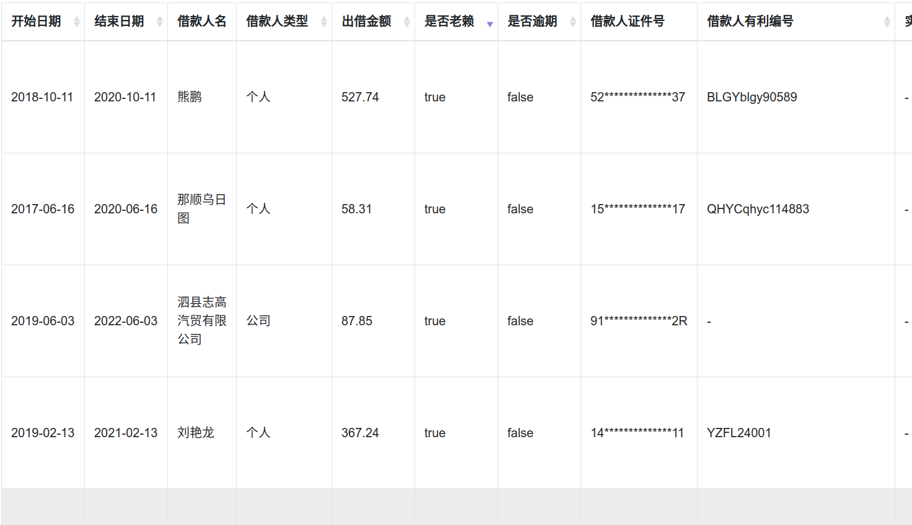
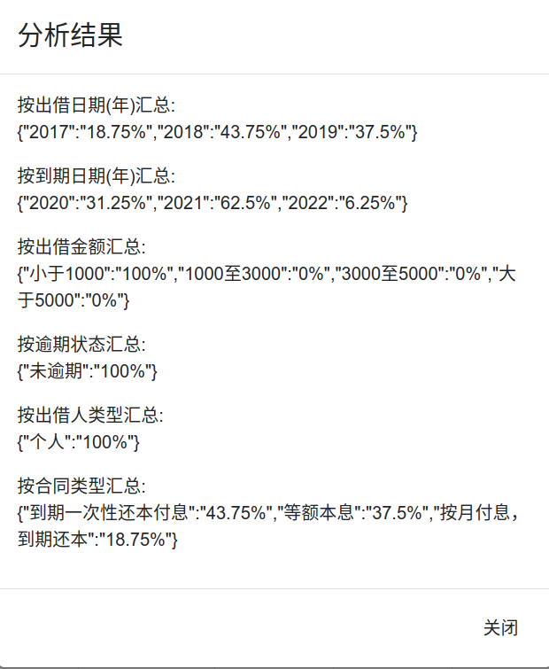
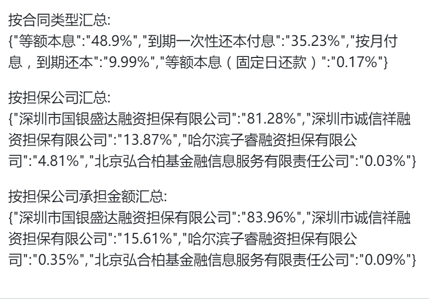
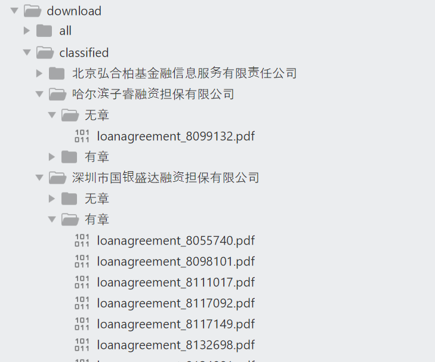
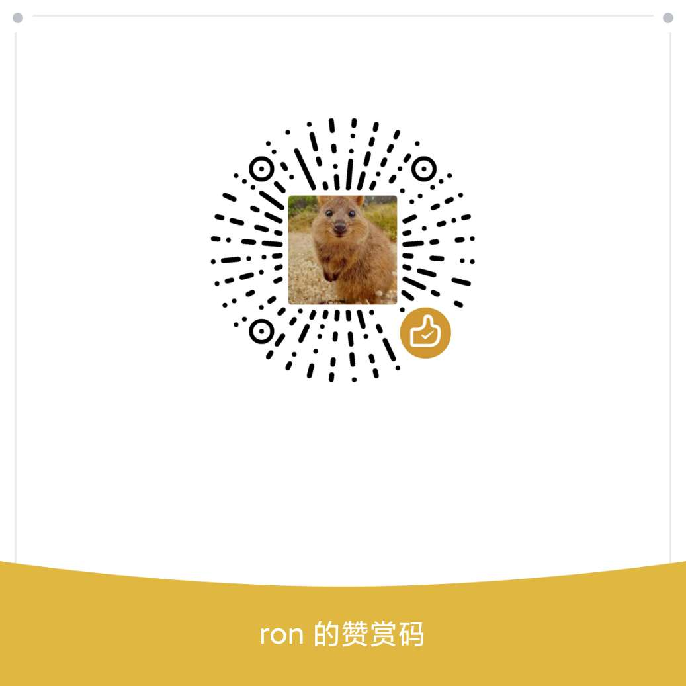

yooli-spider项目说明
-----
ylw合同采集工具

## 基本功能

+ 合同一键下载
+ 合同按担保公司和是否有章分类
+ 合同数据分析

## 手工安装

### 安装依赖应用

* [chrome](https://www.google.cn/intl/zh-CN/chrome/)
* [nodejs](https://nodejs.org/zh-cn/)
* [java](https://repo.huaweicloud.com/java/jdk/13+33/)             
* [elasticsearch](https://elasticsearch.thans.cn/)

> 若不用elasticsearch做数据分析,则无需下载java和elasticsearch分析数据库(此次担保分类无需数据分析)

### 安装合同采集应用

下载[安装包](https://hk5.yrong.space/release.zip) 
解压到任意目录,命令行cd到该解压目录

### 安装npm依赖

```
npm install
```

### 配置

所有可配置项都在解压包根目录的.env文件内,内有配置项说明.缺省配置基本不用改就能用,以下几个配置需要比对一下:

|可能需修改的配置项 | 说明|
|:------|:-------:| 
|CHROME\_BIN\_PATH                |chrome二进制程序路径(需确保和本地一致)|
|CHROME\_DOWNLOAD\_PATH                |chrome缺省下载路径(需确保和本地一致)|
|SaveSearch                |是否存储到搜索数据库elasticsearch(无需数据统计分析配置为false)|


### 启动脚本说明

```
npm run download//下载合同
npm run classify//合同按担保公司和是否有章分类
npm run app//启动数据分析服务,启动后浏览器可访问http://localhost:8080/(需完成合同下载)
```

### 一键安装

win10环境支持一键安装，若需要数据分析服务,解压[vendor安装包](https://hk5.yrong.space/vendor.zip) 内的文件拷贝到之前的release解压目录后install.bat批处理文件上右键以管理员身份运行

### 合同列表示例



### 合同分析示例





### 合同按担保公司和是否有章分类



### 小tips

* 数据采集仅针对个人,数据存储在本地不上传汇聚,保证数据隐私性

* windows/linux/mac下都能跑,除windows环境支持一键安装外其它需自己安装依赖应用

* 合同下载缺省是增量下载方式,若之前通过其它方式下载过合同,先将所有合同拷贝到解压目录的download/all子目录下

* 新合同下载和老赖数据提取的图片验证码部分仍需手工干预,不过因为是增量方式,已下载的合同和已经校验的老赖后续不会重复验证,不要嫌烦哦

* 若不用elasticsearch做数据分析,.env中的SaveSearch配置项可以配置为false

* 测试程序期间.env中的PlanName配置项可配置为一个金额较小的定存宝项目编号名称（例如24-180125）,运行`npm run download`后检查download目录下是否成功生成了相关合同文件,测试没问题配置为空全量下载合同

* 升级可直接下载[安装包](https://hk5.yrong.space/release.zip)后解压dist目录内的所有文件覆盖到原安装目录即可

* 后续打开命令行窗口并启动elasticsearch可直接运行start.bat,当前窗口下再执行`npm run download`下载合同等相关命令即可 

 

### 赞助

> 公益性质项目,觉得好用扫码请我喝杯咖啡吧



