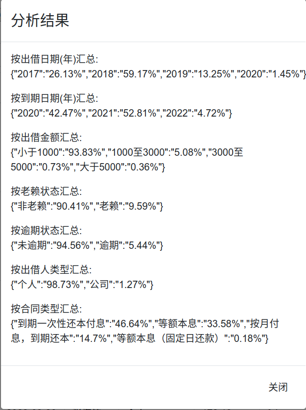

yooli-spider项目说明
-----
ylw数据采集工具

## 基本功能

+ 互金信批平台月度数据采集
+ 合同一键下载
+ 合同数据分析


## 安装依赖应用

* [chrome](https://www.google.com/intl/zh-CN/chrome/)
* [nodejs](https://nodejs.org/zh-cn/)
* [java](https://www.java.com/zh_CN/download/)
* [elasticsearch](https://www.elastic.co/cn/downloads/elasticsearch)


### 配置

|配置文件 | 说明|
|:------|:-------:| 
|.env.example                 |配置环境变量参数文件|

.env.example配置完成后重命名为.env

### 安装依赖

```
npm install
```

### 启动脚本说明

```
npm run init//初始化elasticsearch
npm run download//一键下载合同
npm run app//启动数据分析服务,访问http://localhost:8080/(需要初始化elasticsearch并完成合同下载)
```

### 合同列表示例


### 合同分析示例



### 小tips

* 数据采集仅针对个人,数据存储在本地不上传汇聚,保证数据隐私性

* 不挑系统windows/linux/mac下都能跑,windows环境封装了一键安装脚本,解压[安装包](https://hk5.yrong.space/release.zip) 后install.bat批处理文件上右键以管理员身份运行可一键安装依赖服务及应用程序

* 合同下载缺省是增量下载方式,若之前通过其它方式下载过合同,先将所有合同拷贝到当前目录的download/all子目录下

* 新合同下载和老赖数据提取的图片验证码部分仍需手工干预,不过因为是增量方式,已下载的合同和已经校验的老赖后续不会重复验证,不要嫌烦哦

* 若不用elasticsearch做数据分析,.env中的SaveSearch配置项可以配置为false,无需运行`npm run init`

* 测试程序期间.env中的PlanName配置项可配置为一个金额较小的定存宝项目编号（例如24-180125）,运行`npm run download`后检查download目录下是否成功生成了相关合同文件,测试没问题配置为空全量下载合同


### 赞助

> 公益性质项目,觉得好用扫码请我喝杯咖啡吧


